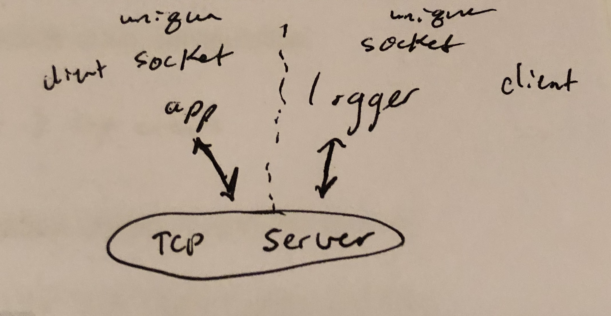

# LAB - 17

## TCP Server

### Author: Julie Erlemeier

### Links and Resources
* [submission PR](https://github.com/jmerlemeier-401-advanced-javascript/tcp-server/pull/2)
* [travis](https://www.travis-ci.com/jmerlemeier-401-advanced-javascript/tcp-server)
* [back-end](https://tcp-server-app.herokuapp.com/)

#### Documentation
* [fs](https://nodejs.org/api/fs.html)

### Setup
#### `.env` requirements
* None

#### Running the app
- need 3 terminal windows
* `node server.js`
* `node app.js filepathfolder/filepath.txt`
* `node logger.js`

#### Tests
* How do you run tests?
* npm install --save jest
* `npm test file.test.js`
* `npm test logger.test.js`

#### UML
